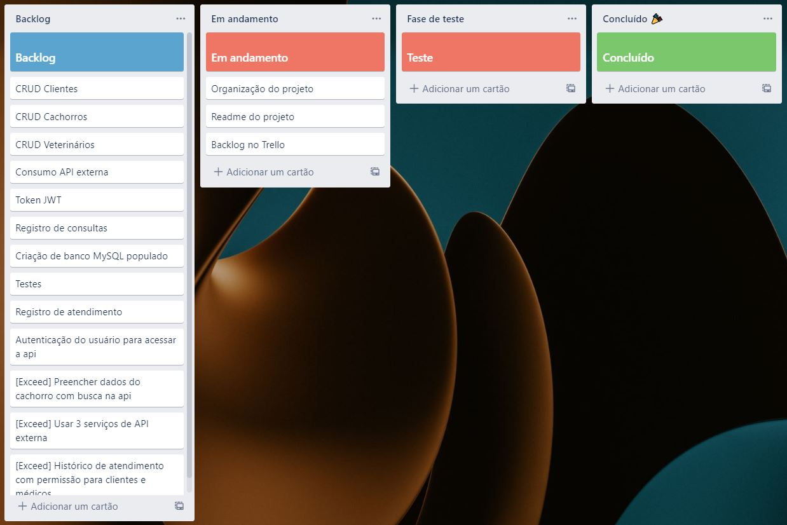

# 🎯 DesafioPetShopManager

Este projeto é uma WEB API de gerenciamento de PetShop.

Com ela você poderá consultar, cadastrar, editar e excluir dados de clientes, animais e veterinários além de obter descrições de consultas realizadas e um registro de todos os atendimentos do seu empreendimento.

Esse sistema ainda conta com serviços de segurança de acesso, para consumir dados da api é necessário estar registrado e logado, além de estar identificado através de um token gerado pelo sistema JWT.

<br>

# 🧩 Referências de API

<details>
<summary><b> 🐶 Entidade Animal</b></summary>

<br>

### 👉 **Retorna todos os animais cadastrados**

```http
  GET - https://localhost:5001/api/v1/Animais
```

<hr><br>

### 👉 **Retorna somente 1 animal cadastrado**

```http
  GET - https://localhost:5001/api/v1/Animais/{id}
```

| Parametro | Tipo     | Descrição                          |
| :-------- | :------- | :--------------------------------- |
| `id`      | `int`    | **Requerido**. Id do Animal        |

<hr><br>

### 👉 **Retorna detalhes da raça pesquisada**

```http
  GET - https://localhost:5001/api/v1/Animais/search/{raca}
```

| Parametro | Tipo     | Descrição                          |
| :-------- | :------- | :--------------------------------- |
| `raca`    | `string` | **Requerido**. Raça do Animal      |

<hr><br>

### 👉 **Cria um registro de animal no banco**

```http
  POST - https://localhost:5001/api/v1/Animais
```

| Parametro        | Tipo     | Descrição                                   |
| :--------------- | :------- | :------------------------------------------ |
| `nome`           | `string` | **Requerido**. Nome do Animal               |
| `clienteID`      | `int`    | **Requerido**. Id do tutor do animal        |
| `sexo`           | `string` | **Requerido**. Sexo do Animal               |
| `pesoAtual`      | `int`    | Peso do Animal                              |
| `alturaAtual`    | `int`    | Altura do Animal                            |
| `dataNascimento` | `string` | **Requerido**. Data de Nascimento do Animal |
| `raca`           | `string` | Raça do Animal                              |

<hr><br>

### 👉 **Atualiza um registro de animal no banco**

```http
  PATCH - https://localhost:5001/api/v1/Animais/{id}
```

| Parametro        | Tipo     | Descrição                                   |
| :--------------- | :------- | :------------------------------------------ |
| `id`             | `int`    | **Requerido**. Id do Animal                 |
| `nome`           | `string` | Nome do Animal                              |
| `clienteID`      | `int`    | Id do tutor do animal                       |
| `sexo`           | `string` | Sexo do Animal                              |
| `pesoAtual`      | `int`    | Peso do Animal                              |
| `alturaAtual`    | `int`    | Altura do Animal                            |
| `dataNascimento` | `string` | Data de Nascimento do Animal                |
| `raca`           | `string` | Raça do Animal                              |

<hr><br>

### 👉 **Exclui 1 animal cadastrado**

```http
  DELETE - https://localhost:5001/api/v1/Animais/{id}
```

| Parametro | Tipo     | Descrição                          |
| :-------- | :------- | :--------------------------------- |
| `id`      | `int`    | **Requerido**. Id do Animal        |

</details>

<details>
<summary><b> 🏢 Entidade Cargo</b></summary>

<br>

### 👉 **Retorna todos os cargos cadastrados**

```http
  GET - https://localhost:5001/api/v1/Cargos
```

<hr><br>

### 👉 **Retorna somente 1 cargo cadastrado**

```http
  GET - https://localhost:5001/api/v1/Cargos/{id}
```

| Parametro | Tipo     | Descrição                          |
| :-------- | :------- | :--------------------------------- |
| `id`      | `int`    | **Requerido**. Id do cargo         |

<hr><br>

### 👉 **Cria um registro de cargo no banco**

```http
  POST - https://localhost:5001/api/v1/Cargos
```

| Parametro | Tipo     | Descrição                          |
| :-------- | :------- | :--------------------------------- |
| `nome`    | `string` | **Requerido**. Nome do cargo       |

<hr><br>

### 👉 **Atualiza um registro de cargo no banco**

```http
  PATCH - https://localhost:5001/api/v1/Cargos/{id}
```

| Parametro | Tipo     | Descrição                          |
| :-------- | :------- | :--------------------------------- |
| `id`      | `int`    | **Requerido**. Id do cargo         |
| `nome`    | `string` | Nome do cargo                      |

<hr><br>

### 👉 **Exclui 1 cargo cadastrado**

```http
  DELETE - https://localhost:5001/api/v1/Cargos/{id}
```

| Parametro | Tipo     | Descrição                          |
| :-------- | :------- | :--------------------------------- |
| `id`      | `int`    | **Requerido**. Id do cargo         |

</details>

<details>
<summary><b> 🎫 Entidade Servico</b></summary>

<br>

### 👉 **Retorna todos os servicos cadastrados**

```http
  GET - https://localhost:5001/api/v1/Servicos
```

<hr><br>

### 👉 **Retorna somente 1 servico cadastrado**

```http
  GET - https://localhost:5001/api/v1/Servicos/{id}
```

| Parametro | Tipo     | Descrição                          |
| :-------- | :------- | :--------------------------------- |
| `id`      | `int`    | **Requerido**. Id do servico       |

<hr><br>

### 👉 **Cria um registro de servico no banco**

```http
  POST - https://localhost:5001/api/v1/Servicos
```

| Parametro | Tipo     | Descrição                          |
| :-------- | :------- | :--------------------------------- |
| `tipo`    | `string` | **Requerido**. Tipo de servico     |
| `valor`   | `double` | **Requerido**. Valor do servico    |

<hr><br>

### 👉 **Atualiza um registro de servico no banco**

```http
  PATCH - https://localhost:5001/api/v1/Servicos/{id}
```

| Parametro | Tipo     | Descrição                          |
| :-------- | :------- | :--------------------------------- |
| `id`      | `int`    | **Requerido**. Id do servico       |
| `tipo`    | `string` | Tipo de servico                    |
| `valor`   | `double` | Valor do servico                   |

<hr><br>

### 👉 **Exclui 1 servico cadastrado**

```http
  DELETE - https://localhost:5001/api/v1/Servicos/{id}
```

| Parametro | Tipo     | Descrição                          |
| :-------- | :------- | :--------------------------------- |
| `id`      | `int`    | **Requerido**. Id do servico       |

</details>

<details>
<summary><b> 👷 Entidade Funcionario</b></summary>

<br>

### 👉 **Retorna todos os funcionarios cadastrados**

```http
  GET - https://localhost:5001/api/v1/Funcionarios
```

<hr><br>

### 👉 **Retorna somente 1 funcionario cadastrado**

```http
  GET - https://localhost:5001/api/v1/Funcionarios/{id}
```

| Parametro | Tipo     | Descrição                          |
| :-------- | :------- | :--------------------------------- |
| `id`      | `int`    | **Requerido**. Id do funcionario   |

<hr><br>

### 👉 **Cria um registro de funcionario no banco**

```http
  POST - https://localhost:5001/api/v1/Funcionarios
```

| Parametro | Tipo     | Descrição                                 |
| :-------- | :------- | :-----------------------------------------|
| `nome`    | `string` | **Requerido**. Nome do funcionario        |
| `cpf`     | `string` | **Requerido**. Cpf do funcionario         |
| `cargoId` | `int`    | **Requerido**. Id do cargo do funcionario |
| `email`   | `string` | **Requerido**. Email do funcionario       |
| `senha`   | `string` | **Requerido**. Senha do funcionario       |

<hr><br>

### 👉 **Atualiza um registro de funcionario no banco**

```http
  PATCH - https://localhost:5001/api/v1/Funcionarios/{id}
```

| Parametro | Tipo     | Descrição                          |
| :-------- | :------- | :--------------------------------- |
| `id`      | `int`    | **Requerido**. Id do funcionario   |
| `nome`    | `string` | Nome do funcionario                |
| `cpf`     | `string` | Cpf do funcionario                 |
| `cargoId` | `int`    | Id do cargo do funcionario         |
| `email`   | `string` | Email do funcionario               |
| `senha`   | `string` | Senha do funcionario               |

<hr><br>

### 👉 **Exclui 1 funcionario cadastrado**

```http
  DELETE - https://localhost:5001/api/v1/Funcionarios/{id}
```

| Parametro | Tipo     | Descrição                          |
| :-------- | :------- | :--------------------------------- |
| `id`      | `int`    | **Requerido**. Id do funcionario   |

</details>

<details>
<summary><b> 🧍 Entidade Cliente</b></summary>

<br>

### 👉 **Retorna todos os clientes cadastrados**

```http
  GET - https://localhost:5001/api/v1/Clientes
```

<hr><br>

### 👉 **Retorna todos os cachorros do cliente cadastrado**

```http
  GET - https://localhost:5001/api/v1/Clientes/CachorroPorCliente/{idCliente}
```

| Parametro   | Tipo     | Descrição                          |
| :---------- | :------- | :--------------------------------- |
| `idCliente` | `int`    | **Requerido**. Id do cliente       |

<hr><br>

### 👉 **Retorna somente 1 cliente cadastrado**

```http
  GET - https://localhost:5001/api/v1/Clientes/{id}
```

| Parametro | Tipo     | Descrição                          |
| :-------- | :------- | :--------------------------------- |
| `id`      | `int`    | **Requerido**. Id do funcionario   |

<hr><br>

### 👉 **Cria um registro de cliente no banco**

```http
  POST - https://localhost:5001/api/v1/Clientes
```

| Parametro  | Tipo     | Descrição                           |
| :--------- | :------- | :---------------------------------- |
| `nome`     | `string` | **Requerido**. Nome do cliente      |
| `cpf`      | `string` | **Requerido**. Cpf do cliente       |
| `telefone` | `int`    | **Requerido**. Telefone do cliente  |
| `email`    | `string` | **Requerido**. Email do cliente     |
| `senha`    | `string` | **Requerido**. Senha do cliente     |

<hr><br>

### 👉 **Atualiza um registro de cliente no banco**

```http
  PATCH - https://localhost:5001/api/v1/Clientes/{id}
```

| Parametro  | Tipo     | Descrição                      |
| :--------- | :------- | :----------------------------- |
| `id`       | `int`    | **Requerido**. Id do cliente   |
| `nome`     | `string` | Nome do cliente                |
| `cpf`      | `string` | Cpf do cliente                 |
| `telefone` | `int`    | Telefone do cliente            |
| `email`    | `string` | Email do cliente               |
| `senha`    | `string` | Senha do cliente               |

<hr><br>

### 👉 **Exclui 1 cliente cadastrado**

```http
  DELETE - https://localhost:5001/api/v1/Clientes/{id}
```

| Parametro | Tipo     | Descrição                          |
| :-------- | :------- | :--------------------------------- |
| `id`      | `int`    | **Requerido**. Id do cliente   |

</details>

<details>
<summary><b> 🧍 Entidade Atendimento</b></summary>

<br>

### 👉 **Retorna todos os atendimentos cadastrados**

```http
  GET - https://localhost:5001/api/v1/Atendimentos
```

<hr><br>

### 👉 **Retorna todos os atendimentos do cliente cadastrado buscando por Id**

```http
  GET - https://localhost:5001/api/v1/Atendimentos/Cliente/BuscaPorId/{id}
```

| Parametro   | Tipo     | Descrição                          |
| :---------- | :------- | :--------------------------------- |
| `id`        | `int`    | **Requerido**. Id do cliente       |

<hr><br>

### 👉 **Retorna todos os atendimentos do cliente cadastrado buscando por nome e cpf**

```http
  GET - https://localhost:5001/api/v1/Atendimentos/Cliente/Busca/{nome}/{cpf}
```

| Parametro   | Tipo     | Descrição                          |
| :---------- | :------- | :--------------------------------- |
| `nome`      | `string`    | **Requerido**. Nome do cliente  |
| `cpf`       | `string`    | **Requerido**. CPF do cliente   |

<hr><br>

### 👉 **Retorna todos os atendimentos do animal cadastrado buscando por Id**

```http
  GET - https://localhost:5001/api/v1/Atendimentos/Animal/BuscaPorId/{id}
```

| Parametro   | Tipo     | Descrição                          |
| :---------- | :------- | :--------------------------------- |
| `id`        | `int`    | **Requerido**. Id do cliente       |

<hr><br>

### 👉 **Retorna todos os atendimentos do animal cadastrado buscando por nome e data de nascimento**

```http
  GET - https://localhost:5001/api/v1/Atendimentos/Animal/Busca/{Nome}/{DataNascimento}
```

| Parametro         | Tipo      | Descrição                                   |
| :---------------- | :-------- | :------------------------------------------ |
| `nome`            | `string`  | **Requerido**. Nome do animal               |
| `dataNascimento`  | `string`  | **Requerido**. Data de nascimento do animal |

<hr><br>

### 👉 **Cria um registro de atendimento no banco**

```http
  POST - https://localhost:5001/api/v1/Atendimentos
```

| Parametro                   | Tipo     | Descrição                               |
| :-------------------------- | :------- | :-------------------------------------- |
| `servicoId`                 | `int`    | **Requerido**. Id do Servico            |
| `clienteId`                 | `int`    | **Requerido**. Id do Cliente            |
| `funcionarioId`             | `int`    | **Requerido**. Id do Funcionario        |
| `animalId`                  | `int`    | **Requerido**. Id do Animal             |
| `pesoDoAnimalAtualizado`    | `double` | Peso do animal no dia do atendimento    |
| `alturaDoAnimalAtualizado`  | `double` | Altura do animal no dia do atendimento  |
| `diagnostico`               | `string` | Diagnóstico do animal                   |
| `observacoes`               | `string` | Observações sobre o animal              |

<hr><br>

### 👉 **Atualiza um registro de atendimento no banco**

```http
  PATCH - https://localhost:5001/api/v1/Atendimentos/{id}
```

| Parametro                   | Tipo     | Descrição                               |
| :-------------------------- | :------- | :-------------------------------------- |
| `id`                        | `int`    | **Requerido**. Id do Atendimento        |
| `diagnostico`               | `string` | Diagnóstico do animal                   |
| `observacoes`               | `string` | Observações sobre o animal              |

</details>

<br>

# 🧰 Como utilizar

1 - Abra seu terminal e clone o repositório usando esse comando:
- git clone https://git.gft.com/aozi/desafiopetshopmanager.git

2 - Entre na pasta do projeto clonado:
- cd desafiopetshopmanager

3 - Dentro da pasta do projeto, execute esses dois comandos: 
- dotnet ef database update (Carrega o migration criando e populando o banco de dados) 
- dotnet run --project PetShopManager (Executa a aplicação)

Para rodar os testes, execute esse comando:
- dotnet test

Nosso banco de dados já possui dois usuários cadastrados com diferentes permissões:

<details>
<summary><b>👷 Funcionario</b></summary>
<br>

**Email:** funcionario@gft.com

**Senha:** Gft@1234

| **Permissões**                                        |
| :---------------------------------------------------- |
| Possui permissão para todos os EndPoints da aplicação |

</details>

<details>
<summary><b>🧍 Cliente</b></summary>
<br>

**Email:** cliente@gft.com

**Senha:** Gft@1234

| **Permissões**                                                                                                       |
| :------------------------------------------------------------------------------------------------------------------- |
| **Entidade Animal:** GET com Id / GET com raça / GET random dogs / POST / PATCH                                      |
| **Entidade Atendimentos:** GET cliente com Id / GET cliente com nome e cpf / GET animal com id / GET animal com nome |
| **Entidade Cargo :** Não há permissão                                                                                |
| **Entidade Login:** POST                                                                                             |
| **Entidade Servico:** Não há permissão                                                                               |
| **Entidade Cliente:** GET com Id / POST / PATCH                                                                      |
| **Entidade Funcionario:** Não há permissão                                                                           |

</details>

<br>

# 🛠 Ferramentas utilizadas

 - .Net 5.0;
 - ASP NET Core MVC;
 - ASP NET Core WEB API;
 - EntityFrameworkCore;
 - Visual Studio Code;
 - xUnit;
 - DataAnnotations;
 - IdentityModel.Tokens.Jwt;
 - Security.Claims;
 - Newtonsoft.Json;
 - AspNetCore.Authorization;
 - AspNetCore.Authentication.JwtBearer;
 - Extensions.DependencyInjection;
 - MySQL.

<br>

# 📖 Aprendizados

- [x] Conceitos de arquitetura MVC;

- [x] CRUD com Pomelo.EntityFrameworkCore em banco MySQL;

- [x] Customização de migrations para popular banco de dados;

- [x] Uso de DataAnotation para validação de dados;

- [x] Criar e manipular banco de dados com relação entre entidades;

- [x] Criar rotas para acesso a dados do sistema;

- [x] Criar sistema de autenticação por tokens JWT;

- [x] Criar testes unitários usando banco de dados mockado;
  
- [x] Requisição de API externa; 

<br>

# Imagens do processo de organização e criação do projeto

<details>
<summary>🖼️ Backlog do projeto</summary>

</details>